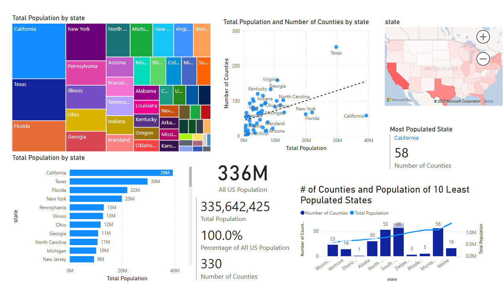
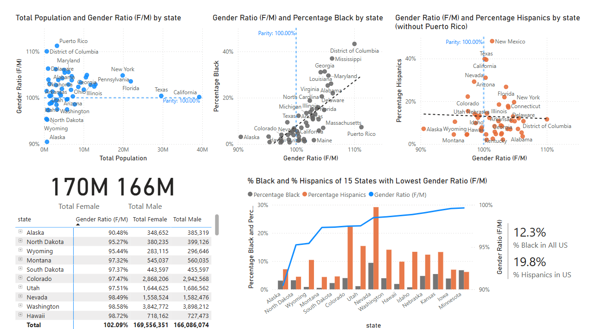

# US Demographics 2023

Simple [Power BI visualizations of 2023 US Census](#power-bi-dashboard) data organized by [Ahmed Mohamed on Kaggle](https://www.kaggle.com/datasets/ahmedmohamed2003/county-level-demographic-population-race-gender/data).

## Power BI Dashboard

### States Page

Figure 1. States page

- The treemap and the bar chart for showing proportions of state populations.
- The scatter plot of Population vs # of Counties of each state to show that the relationship is not as linear as one would expect. It shows states like Texas, Virginia, and Georgia have relatively high number of counties given their populations, but states like California has very few counties despite being the most populous state.
- The line and column chart of # of Counties vs Population of 15 least populated states shows again that the relationship between # of Counties and Population is not strong.

Figure 2. Interactive section of States page

- The multirow card shows population, population percentage, and # of counties of filtered state. 

### Race Page

Figure 3. Race page

- The stacked bar charts shows proportion of white/black/neither and hispanics/non-hispanics population in each state.
- The scatter plot of population vs race percentage shows slight positive relation.

Figure 4. Interactice section of Race page

- The cards show Percentage of Black and Hispanics in each state.
- The pie chart shows porportion of white, black, and others in relationship to each other and to total population.

### Gender Page

Figure 4. Gender page

- The scatter plots show Gender Ratio (female population divided by male population) in relation to different measures.
    - Noticeable positive relationship between Gender Ratio and Percentage of Black population in states.
    - No such relationship between Gender Ratio and Percentage of Hispanics population in states when you remove Puerto Rico.
- The line and column chart of 15 states with lowest Gender Ratio (meaning low female to male ratio) shows lower than average proportion of Black population but doesn't show such clear pattern with Hispanics population. 

## Setup

As a practice, deployed local instance of PostgreSQL database on Postgres Official Docker container. Created a table, inserted the dataset, and connected pgAdmin4 for simple SQL EDA. Then, connected Power BI Desktop and built the dashboard. 

## Dataset Features

The description of dataset features copied from the Kaggle dataset page mentioned above.

The dataset includes the following columns:

    County: Name of the county.
    State: Name of the state the county belongs to.
    State FIPS Code: Federal Information Processing Standard (FIPS) code for the state.
    County FIPS Code: FIPS code for the county.
    FIPS: Combined State and County FIPS codes, a unique identifier for each county.
    Total Population: Total population in the county.
    Male Population: Number of males in the county.
    Female Population: Number of females in the county.
    Total Race Responses: Total race-related responses recorded in the survey.
    White Alone: Number of individuals identifying as White alone.
    Black or African American Alone: Number of individuals identifying as Black or African American alone.
    Hispanic or Latino: Number of individuals identifying as Hispanic or Latino.

## PostgreSQL EDA

[Simple Exploratory Data Analysis done in SQL](https://github.com/js3331/us-demographics-2023/blob/main/eda_us_demographics_2023.sql) as a basic sanity check step.

Observed that there are 50 states, District of Columbia, and Puerto Rico in the dataset, validated the number of US counties (and county equivalent) with external sources, and observed that there are duplicates of county names, which is reasonable.
